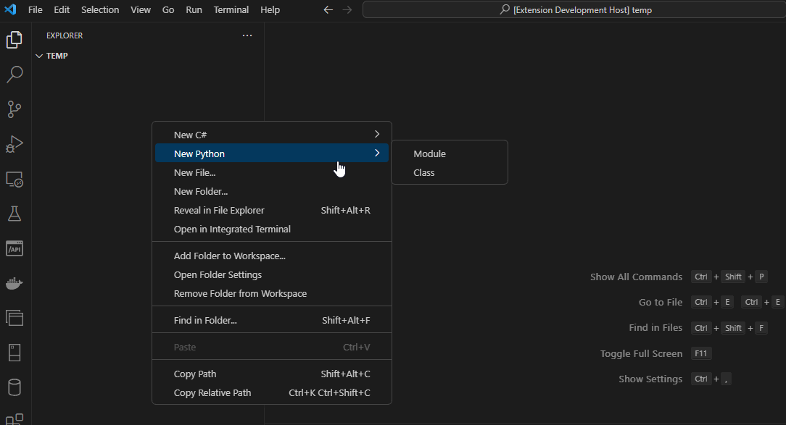
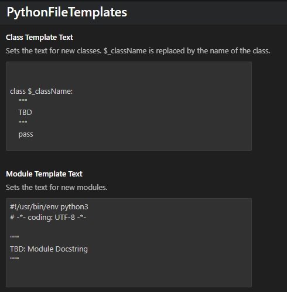
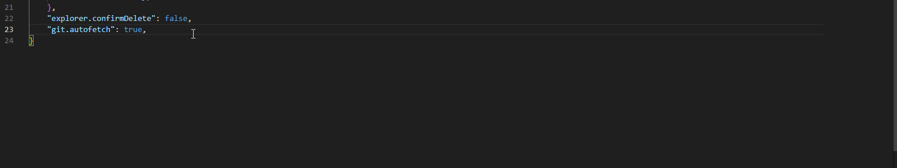

# Python File Templates

This extension provides an easy way to create Python files based on templates by expanding the context menu of the VS Code File Explorer.

In the current version all templates are fixed. Future versions will support custom templates.

## Features
Just right-click in the File Explorer and select a template to create a file. You will be prompted to input the name of the object.

The file name for a class is converted to snake case automatically, so "SomeClass" will be saved as "some_class.py".

Currently supported:
* Modules
* Classes

## Requirements

Currently there are no requirements to be met. I will try keeping this extension as small and basic as possible. :)

## Extension Settings

The template texts are defined in the following settings.
* `pythonfiletemplates.moduleTemplateText`
* `pythonfiletemplates.classTemplateText`

They can be changed in the UI and in settings.json. 

## Release Notes
See [CHANGELOG](CHANGELOG.md)

## Road Map

* Add packages
* Add settings for custom templates
* Add Cookiecutter support for more complex templates
